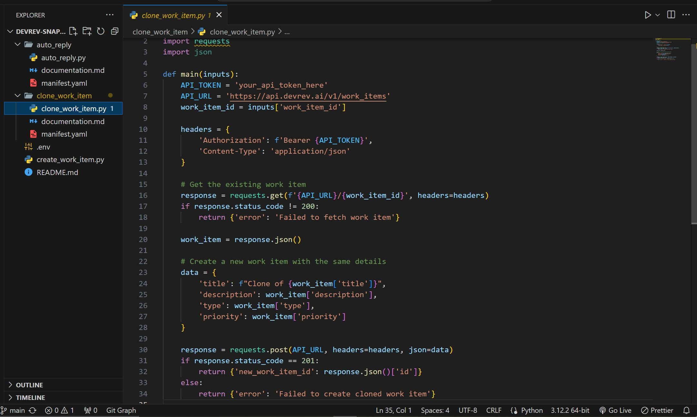

## Snap-in 1: Clone a Work Item 

### Instructions to Install and Use the Snap-in:

1. Place the manifest.yaml and clone_work_item.py files in your snap-in directory.
2. Use the DevRev CLI to install the snap-in:
   ```bash
   devrev snap-in install /path/to/snap-in-directory
   ```
   
3. Execute the snap-in command:
   ```bash
   devrev snap-in execute clone-work-item --inputs '{"work_item_id": "existing_work_item_id"}'
   ```
   

### Screenshot/Demonstration: 

